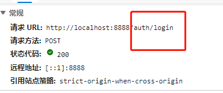
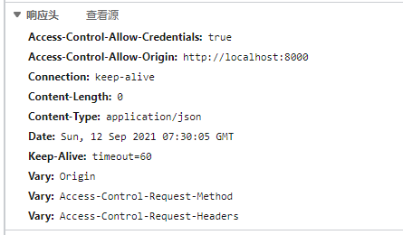
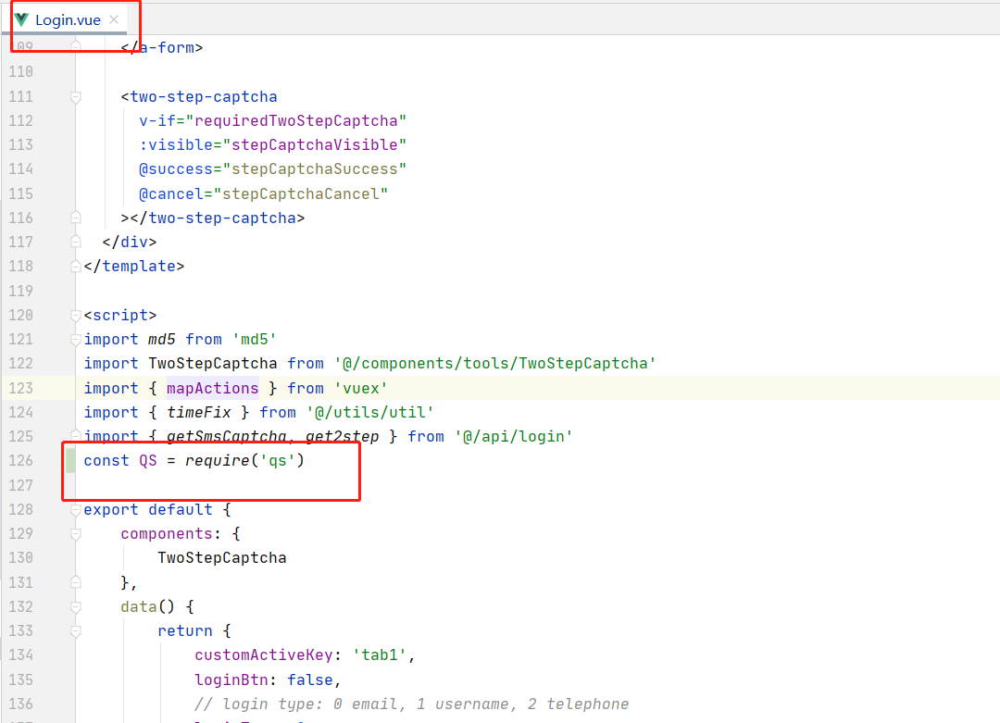
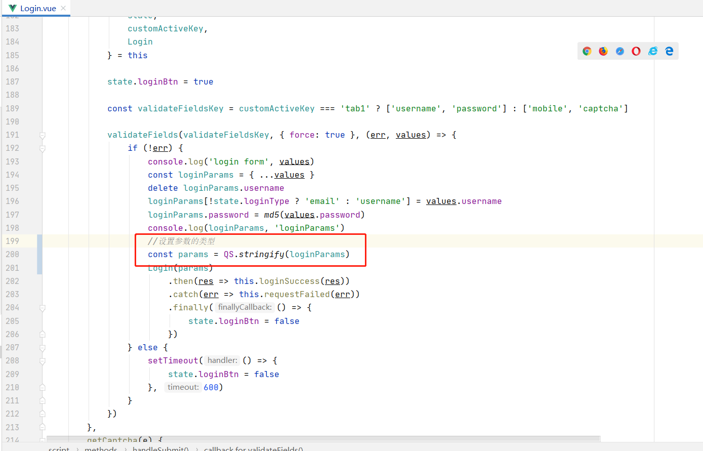
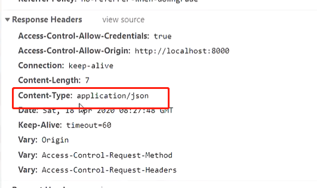

# 第一节课和家云

## 第一节课内容的总体大纲：

1. 调试前端项目的代码修改
2. sql文件导入
3. 后端的创建
4. mybatis-plus代码生成
5. 后端接收参数的调试，跨域请求等
6. mapper.xml的sql
7. 返回json字符串

# 1.上半节课

## 1.前端项目的修改

1. main.js 中把import'./mock'注释掉

2. .env.development中
3. src/api/index.js中把UserInfo：‘users/info’中的s去掉

## 2.sql文件导入

建立hjy数据库时字符集选择utf8mb4


## 3.后端项目创建

1)  依赖导入

2）代码生成器 (在测试类包下建立，并生成)

3）yml配置（以及log4j.properties）

4）跨域问题解决

1. 配置全局配置，(建立config包，详情看Lian的note)

   ```java
   import org.springframework.context.annotation.Bean;
   import org.springframework.context.annotation.Configuration;
   import org.springframework.web.cors.CorsConfiguration;
   import org.springframework.web.cors.UrlBasedCorsConfigurationSource;
   import org.springframework.web.filter.CorsFilter;
   
   /**
    * @author: zhanghp
    * @version: 1.0
    */
   @Configuration
   public class CorsConfig {
       private CorsConfiguration buildConfig() {
           CorsConfiguration corsConfiguration = new CorsConfiguration();
           //  你需要跨域的地址  注意这里的 127.0.0.1 != localhost
           // * 表示对所有的地址都可以访问
          
           corsConfiguration.addAllowedOriginPattern("*");
           //  跨域的请求头
           corsConfiguration.addAllowedHeader("*"); // 2
           //  跨域的请求方法
           corsConfiguration.addAllowedMethod("*"); // 3
           //加上了这一句，大致意思是可以携带 cookie
           //最终的结果是可以 在跨域请求的时候获取同一个 session
           corsConfiguration.setAllowCredentials(true);
           return corsConfiguration;
       }
       @Bean
       public CorsFilter corsFilter() {
           UrlBasedCorsConfigurationSource source = new UrlBasedCorsConfigurationSource();
           //配置 可以访问的地址
           source.registerCorsConfiguration("/**", buildConfig()); // 4
           return new CorsFilter(source);
       }
   }
   ```

   ------

   有一个错误代码问题：

   ```
   这个地方老师用的是addAllowOrigin
   但报错：When allowCredentials is true,allowedOrigins cannot contain the special 		value "*" since that cannot be set on the "Access-Control-Allow-Origin" 			response header. To allow credentials to a set of origins, list them 				explicitly or consider using "allowedOrig
           
   所以修改为 addAllowedOriginPattern
   ```

   

2. 配置局部配置，也可在controller类上添加注解

   ```
   @CrossOrigin(origins = "*",allowCredentials="true",allowedHeaders = "*",methods = {})
   ```

## 4.前后端调试

前端，后端启动后，前端调用后端路径所出现的问题



所以后端的controller需在@RequestMapping添加相对应的路径

```java
@RestController
public class Login {
	//添加/auth/login
    @RequestMapping("/auth/login")
    public String Login01(){
        System.out.println("success");
        return "";
    }
}
```


# 2.下半节课

## 1.后端请求参数的获取问题

1. 前端返回回来的是json字符串，通过Content-Type可看出：



解决办法：

1）使用@RequestBody，通过Map集合接收参数

```java
 @RequestMapping("/auth/login")
    public String login(@RequestBody Map<String,Object> map){
        System.out.println("login");
        System.out.println(map);
        return "success";
    }
```

2）前端传递参数时，进行数据的转换，转换为后端接收的方式：

​      前端项目根目录下运行npm install qs，安装对应的组件，在use/Login.vue文件添加

```
const QS = require('qs')
```



​	并在传递参数的代码其中**添加**设置参数类型的代码

```
//设置参数的类型
const params = QS.stringify(loginParams)
```



controller

```java
@RestController
public class Login {
    @RequestMapping("/auth/login")
    public String Login01(String username,String password){
        System.out.println(username + "---" + password);
        return "";
    }
}
```


## 2.mapper文件的编写

注意的地方：

1. 在mapper接口处，用@param向xml传输，可以用#{参数名}，而不用#{arg0}../${param1}。

2. 因为用了关联的一对一查询，所以需要在实体类进行属性的修改，进而完成关联，详情看mybatis一对一关联

3. 因为前端用了md5加密，从前端传输到后端的密码是加密的，**如果直接输入密码‘1’，反而不行**，如下：

   ```sql
   select a.*,b.dept_privileges,b.dept_manage_privileges,c.role_privileges,d.company_simple_name
           from tbl_user_record a
           left outer join tbl_dept b on a.user_dept = b.id
           left outer join tbl_role c on a.user_role = c.id
           left outer join tbl_company d on a.company= d.id
           where a.user_name = 'admin' and a.user_password= 
           //加密的密码
           'c4ca4238a0b923820dcc509a6f75849b'
   ```

TblUserRecordMapper.xml语句：

```xml
<resultMap id="loginResultMap" type="com.zhanghp.bean.TblUserRecord">
        <id column="id" property="id" />
        <result column="user_name" property="userName" />
        <result column="user_password" property="userPassword" />
        <result column="user_type" property="userType" />
        <result column="user_gender" property="userGender" />
        <result column="user_job" property="userJob" />
        <result column="user_status" property="userStatus" />
        <result column="office_phone" property="officePhone" />
        <result column="inner_phone" property="innerPhone" />
        <result column="move_phone" property="movePhone" />
        <result column="email" property="email" />
        <result column="is_send_msg" property="isSendMsg" />
        <result column="start_date" property="startDate" />
        <result column="stop_date" property="stopDate" />
        <result column="birthday" property="birthday" />
        <result column="ip_rule" property="ipRule" />
        <result column="user_hiredate" property="userHiredate" />
        <result column="is_send_wchat" property="isSendWchat" />
        <result column="remark" property="remark" />
        <result column="is_dept_admin" property="isDeptAdmin" />
        <result column="last_login_date" property="lastLoginDate" />
        <result column="create_person" property="createPerson" />
        <result column="create_date" property="createDate" />
        <association property="tblRole" javaType="com.zhanghp.bean.TblRole">
            <result property="rolePrivileges" column="role_privleges"></result>
        </association>
        <association property="tblDept" javaType="com.zhanghp.bean.TblDept">
            <result property="deptPrivileges" column="dept_privileges"></result>
            <result property="deptManagePrivileges" column="dept_manage_privileges">	</result>
        </association>
        <association property="tblCompany" javaType="com.zhanghp.bean.TblCompany">
            <result property="companySimpleName" column="company_simple_name"></result>
        </association>
    </resultMap>
    <select id="login" resultMap="loginResultMap">
        select a.*,
            b.dept_privileges,
            b.dept_manage_privileges,
            c.role_privileges,
            d.company_simple_name
        from tbl_user_record a
        left outer join tbl_dept b on a.user_dept = b.id
        left outer join tbl_role c on a.user_role = c.id
        left outer join tbl_company d on a.company= d.id
        where a.user_name = #{username} and a.user_password=#{password}
    </select>
```

## 3.service和controller编写

```java
@Service
public class LoginService {
    @Autowired
    private TblUserRecordMapper tblUserRecordMapper;
    public TblUserRecord login(String username,String password){
        return tblUserRecordMapper.login(username,password);
    }
}
```

```java
@RestController
public class Login {
    @Autowired
    private LoginService loginService;
    @RequestMapping("/auth/login")
    public TblUserRecord Login01(String username,String password){
        TblUserRecord login = loginService.login(username, password);
        System.out.println(login);
        return login;
    }
}
```

## 4.对象修改json数据返回的原因


因为浏览器的响应体中Content-Type是json，所以需要把对象封装成json格式



1. 导入fastjson包（也可以用gson）

2. 把对象封装成json字符串返回

   ```java
   @RestController
   public class Login {
       @Autowired
       private LoginService loginService;
       @RequestMapping("/auth/login")
       public JSONObject Login01(String username,String password){
           TblUserRecord login = loginService.login(username, password);
           System.out.println(login);
           return JSONObject.parseObject(JSONObject.toJSONString(login));
       }
   }
   ```

## 5.前端后端，账号密码传输调用sql出现的问题

**问题**：org.apache.ibatis.binding.BindingException: Invalid bound statement (not found): com.zhanghp.mapper.TblUserRecordMapper.login

**解释**：即在mybatis中dao接口与mapper配置文件在做映射绑定的时候出现问题，简单说，就是接口与xml要么是找不到，要么是找到了却匹配不到。

```xml


因为我们的xml在mapper层，没在resource目录下，所以造成编译后的targer/classes/com/zhanghp/mapper目录下没有xml文件，所以需要在pom文件添加如下代码,让其识别到src下的xml：
<build>
        <resources>
            <resource>
                <directory>src/main/java</directory>
                <includes>
                    <include>**/*.xml</include>
                </includes>
            </resource>
        </resources>
</build>
```

## 6.连老师上课出现的问题

1. xml的javaType写成jdbcType
2. 一对一关联后，实体类所被关联属性**没改成**关联的引用类

